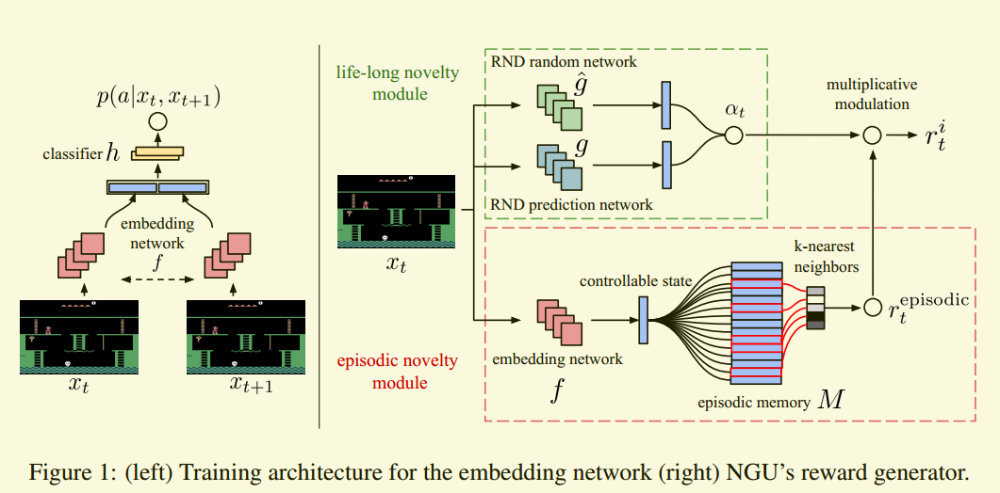

# NGU论文阅读-(Never Give Up: Learning Directed Exploration Strategies)
Badia, Adrià Puigdomènech, et al. "Never give up: Learning directed exploration strategies." arXiv preprint arXiv:2002.06038 (2020).

这篇论文可以看作是三篇论文的结合：
- Curiosity-driven Exploration by Self-supervised Prediction
- Neural Episodic Control
- Exploration by Random Network Distillation

## Background
强化学习方法如果需要收敛到最优策略，需要对无穷空间中的每个状态-动作对进行大量的访问，而首先如何访问所有的动作-状态对的问题，就是强化学习中的探索问题。
这种问题的简单解决方法如 $\epsilon - greedy$ 和Boltzmann exploration，利用在智能体在选择每个动作时候，以一定的概率促使其选择所有动作。该方法在表格类的问题中表现良好，但随着状态空间的增大，其需要用来训练的数据会大量增多。

因此，高级一些的方法是利用内在奖励来促进智能体访问所有的状态，也分为两种：
- 第一种利用当前状态和已访问过状态的区别来定义
- 第二种利用预测模型的误差来定义

第一种方法中，随着智能体对环境的探索，初期完全不认识的状态也变得很熟悉，因此对应的探索奖励会随着探索的进行而变少，所以智能体的策略最后就是基于最大化累计外在奖励而得到的(内在奖励最后趋近于0)，保证了策略收敛的一致性。但问题在于随着探索的进行，某些状态的新奇性逐渐消失，就不再鼓励智能体再次访问此状态，这样从此状态出发的后续可能性就得不到验证。

第二种方法一般需要建立模型，建模本身的代价是昂贵的，而且扩展性可能就没那么强。

本文则希望利用同一个网络，同时学习探索和利用，利用策略专注于如何最大化累计外在奖励，而探索策略不会像方法一一样成为无方向的策略(内在奖励不会随着训练趋近于0)。因此本文设计的内在奖励会鼓励智能体重复探索已访问过的状态。

## Methods
本文也是好奇心机制的一种变种，这里的内在奖励$r^i_t$满足三个性质：
- 它非常不鼓励在同一个episode中访问同一个状态
- 它慢慢地不鼓励访问在多个episode都访问到的状态
- 状态的概念忽略了环境中不受智能体行为影响的方面。

论文中内在奖励的主要思想很简单，主要有两部分组成：单个episode中的新颖程度(episodic novelty) 和整个训练阶段的新颖程度(life-long novelty)。Episodic novelty鼓励智能体能周期性地在不同episodes之间访问相同的状态，但不鼓励在同一episode中访问相同的状态。而life-long novelty则逐渐降低不同episodes之间访问相同状态的新颖性。

本文设计了life-long novelty module和 episodic novelty module两个模块来计算内在奖励。如图所示：

Episodic novelty主要用论文Neural Episodic Control中的 episodic memory来解决，其中的embedding network主要用 Curiosity-driven Exploration by Self-supervised Prediction方法，life-long novelty则使用论文Exploration by Random Network Distillation中的Random Network Distillation来解决。

### Embedding Network 
$f:\mathcal{O} \rightarrow \mathbb{R}^p$将当前的观测值映射到维度是$p$的向量中。映射的训练方法就是Curiosity-driven Exploration by Self-supervised Prediction中给定$t$与$t+1$时刻的两个观测值，预测观测值转移时所做的动作$p(a|x_t,x_{t+1})=h(f(x),f(x_{t+1}))$，在这个预测的训练过程中训练这个映射。

### Episodic memory and intrinsic reward
Episodic memory $M$ 就是一个动态的储存embedding后状态的缓冲区$\{f(x_0), f(x_1),...,f(x_{t-1})\}$。

对应的内在奖励的定义为：
$r^{episodic}_t = \frac{1}{\sqrt{n(f(x_t))}} \thickapprox\frac{1}{\sqrt{\sum_{f_i\in N_k}K(f(x_t),f_i)}+c}$
其中$n(f(x_t))$表示状态$f(x_t)$访问过的次数，利用核函数$K:\mathbb{R}^p \times \mathbb{R}^p \rightarrow \mathbb{R}$来表示该状态与其他状态的相似度之和，以此来近似$n(f(x_t))$。

### Integrating life-long curiosity
Life-long curiosity即是在内在奖励的基础上增加了一个动态系数$\alpha$
：
$r^i_t = r^{episodic}_t * min\{max\{\alpha_t,1\}, L\}$
这个系数代表当前状态有多新颖，用的是Exploration by Random Network Distillation方法。该方法也非常简单，任意选定一个随机的、权值固定不变的网络$f:\mathbf{O}\rightarrow\mathbb{R}^k$和一个预测网络$\hat{f}:\mathbf{O}\rightarrow\mathbb{R}^k$。让这个预测网络尽可能接近随机网络:

$err(x_t)=||\hat{f}(x_t;\theta)-f(x_t)||^2$

$\alpha_t = 1 + \frac{err(x_t)-\mu_e}{\sigma_e}$
