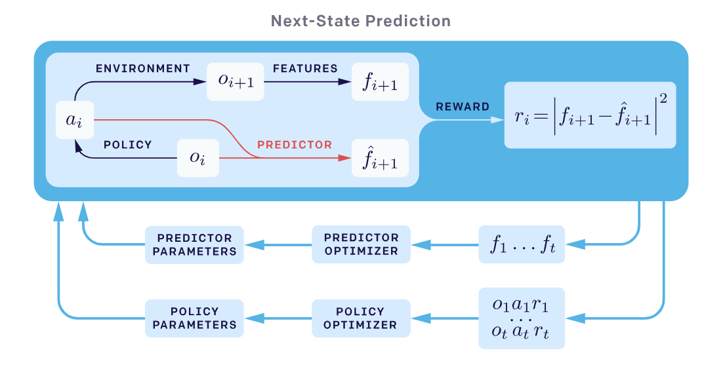
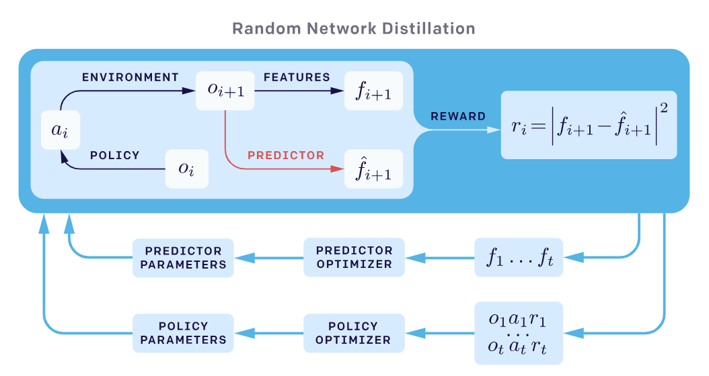
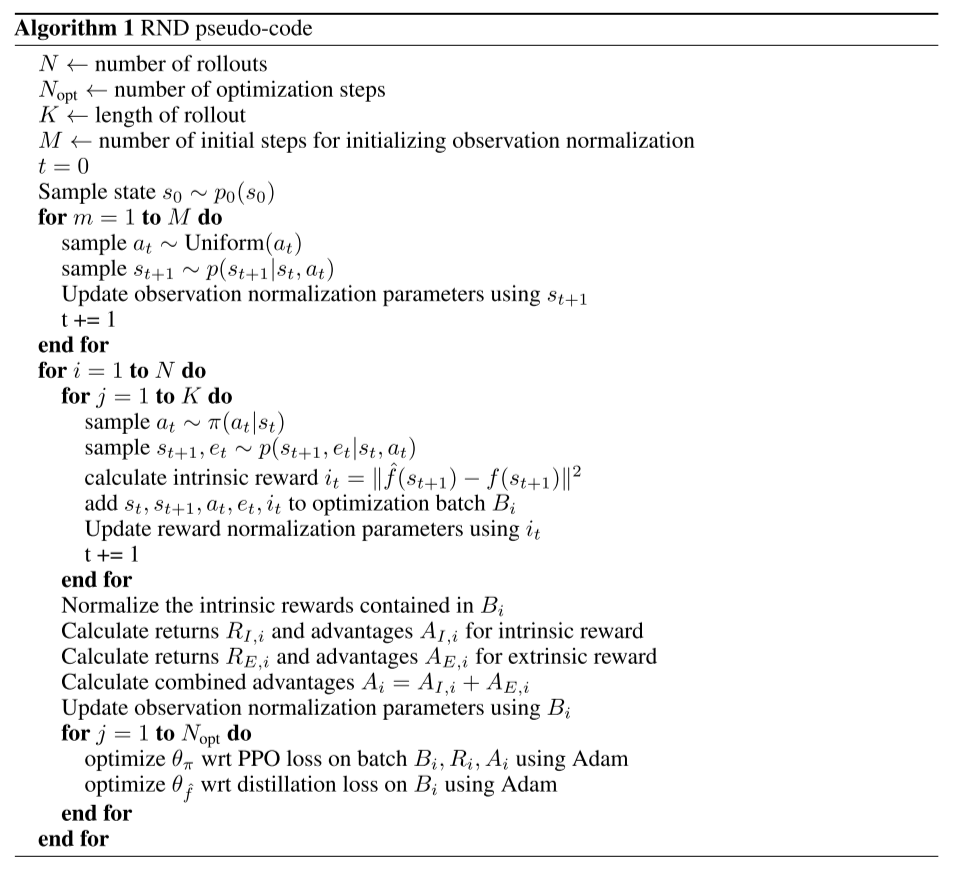

# RND论文阅读-(Exploration by Random Network Distillation)
Burda, Yuri, et al. "Exploration by Random Network Distillation." arXiv preprint arXiv:1810.12894 (2018).

## Motivation
好奇心机制的一种新实现，前面的工作设计的intrinsic reward，有基于动力学模型预测误差的好奇心机制ICM，也有基于各种信息增益的VIME。

前面的Curiosity-Driven方法会从经验中学习下一个状态的预测模型，并将预测结果和实际结果的误差作为intrinsic reward使用。基于Curiosity-Driven的Next-state预测模型：

## Methods
本文设计的初衷是基于对状态访问的计数(count-based)来定义intrinsic reward，而由于是高维连续空间，因此这个计数更多的是密度估计。如果访问到的状态次数较少，则对应的intrinsic reward值就更多，反之亦然。

本文利用了两个不同随机参数的网络，一个更新(predictor)  $\hat{f}: \mathcal{O}\rightarrow \mathbb{R}^k$，一个不更新(target)$f: \mathcal{O}\rightarrow \mathbb{R}^k$。target网络有个前提是对于不同的原始输入，其输出也不同，也就是简历observation到R之间的一一映射关系。因为predictor会进行更新，所以当同样的observation作为predictor输入时，利用MES $||\hat{f}(x;\theta) - f(x)||^2$即可计算差异性。

其实目的就在于，当我的predictor的输入数据被访问以及训练后，新输入的observation对应的$\hat{f}$和$f$之间的差异就会变小，说明当前状态已经访问过，随着次数的增多，则奖励会越来越小。因此当智能体遇到新状态时，会获得更多的intrinsic reward，从而鼓励其去访问更新的状态。

## Noisy-TV Problem
Agent 被安排在一个迷宫里，它的任务是找到最高奖励的对象（和在超市里找奶酪的道理一样）。迷宫中有一台电视，而 Agent 有它的遥控器。但是电视只有几个台（每个台放的节目不一样），每按一下遥控器，电视就会随机切换频道。在这种情况下， Agent 应该怎么做呢？

对于基于误差的好奇心方程来说，调换频道会导致较大的奖励，因为每次换台都是无法预测的，充满惊喜。重要的是，当所有频道轮换一遍之后，随机选择仍会让 Agent 感到惊奇， Agent 仍然可能会预测错误。所以， Agent 为了获得不断的惊喜、得到奖励，就会一直站在电视机前不走。所以为了避免这种情况，该如何重新定义好奇心呢？

因为 TV 上的节目是随机播放的，也就是下一状态根本无法预测，之前的 Curiosity-Driven 的预测模型无法解决这个问题。在《蒙特祖玛的复仇》游戏里，基于 与现有方法不同，RND引入的内在 reward 基于预测下一状态下固定且随机初始化的神经网络的输出。在《蒙特祖玛的复仇》游戏中，基于 Curiosity-Driven 的算法会出现在两个房间来回切换的问题。

## Note
文中说到，一般神经网络预测误差主要由以下四个部分构成
- 预测器无法泛化，因为训练集不够
- 预测目标是随机的
- 缺少必要的输入信息
- 模型能力不足以适应目标函数

第一点是必要的，泛化能力差就代表了预测误差高也就是好奇心高。第二点导致到了Noisy-TV问题，应该避免。同样的，第三点和第四点也要去除。

于是提出了RND算法，引入的内在 reward 是基于预测下一状态下 固定且随机初始化的神经网络 的输出。

  
## Algorithm
 

