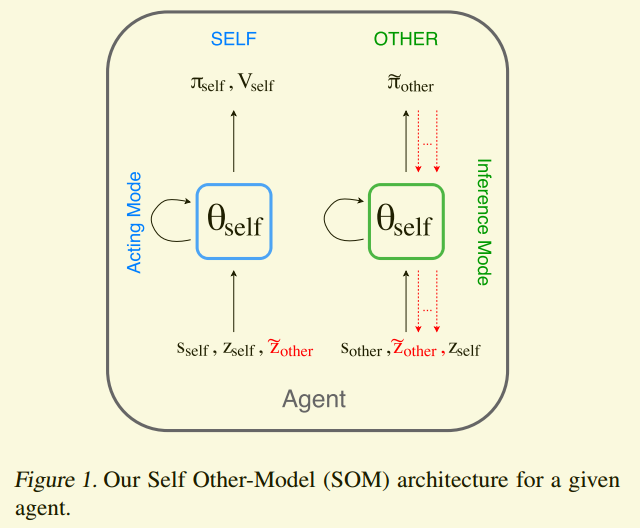
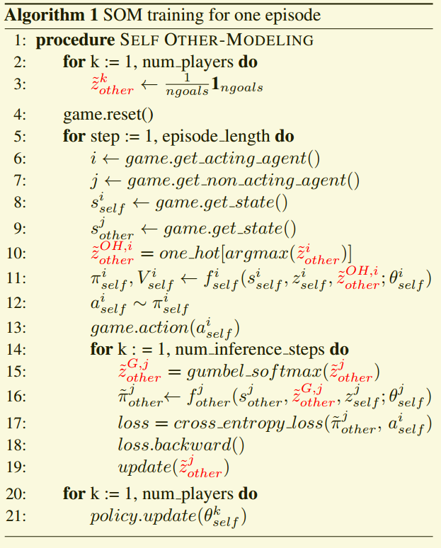

# SOM论文阅读-(Modeling Others using Oneself in Multi-agent Reinforcement Learning)
Raileanu, Roberta, et al. "Modeling others using oneself in multi-agent reinforcement learning." International conference on machine learning. PMLR, 2018.

## Motivation
多智能体环境下，每个智能体只能基于自己的认识去选择行为，但环境提供的奖励是对环境内所有智能体，所以当智能体可以依靠自己对对手/朋友的建模来预判行为时，会对自己的行为起到一个促进作用。

本文的目的在于让智能体推测其它智能体会做什么，“what would be my goal if I had acted as the other player had?” 实现的方式是用一个以状态和目标为输入的（多层递归）神经网络来参数化智能体的行为和价值函数。

## Methods
模型的结构：

智能体的策略模型和推测模型的参数是相同的，只是输入和输出不同，如图所示。
输入可以看出，此方法要求环境完全可观察，从而能明确自己和其它智能体的状态。
action mode 输出的是智能体自己的动作和价值，inference mode 输出的是其推测的其它智能体的可能动作。

这样智能体每次采取行动的的时候，都需要首先给自己一个goal，这个goal是基本固定的，其中self和other使用的是同一个网络，为的是能让自己站在对方的角度，看到自己当前的状态和goal怎么做出决策。

伪代码

缺陷：
一：优化的z other的时候，整体的参数是不变的，但是问题就出在这个观察其他人先动，在很多时候，其实是没有这个条件的，就是先看别人做动作是做不到的，拿上一次的动作和state应该更科学一些。从这个地方出发，对比阶段，其他算法也并没有获得其他agent的动作，而该算法获得了。对比实验上不充分。

二：需要明确规定goal，这本身在很多游戏中就是不可能的，也就是说限制了应用环境。

三：goal有点弱，也就是goal是一定的，我的目标是收集红色，那么输入可能就是[1,0,0]，但是事实上，agent的goal应该是不断变化的，当前状态下想要到达的状态。

四：耗时，推断阶段十分的耗时。
